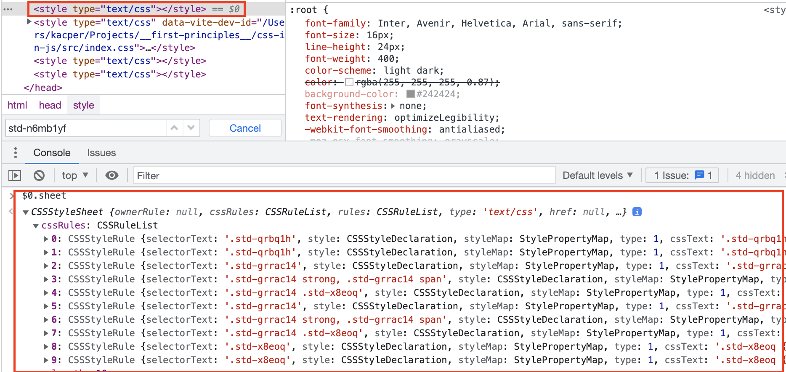

# Simplistic implementation of runtime CSS-in-JS in use with React 18:

1. style element is created and appended to head and passed for mutation
2. we iterate throughout the list of all html tags and create a mapping function for each of them stored in `styled` obj
3. mapping function creates a random classname which is used in the `insertStyle` fn. the style is appended in the style element `cssRules` list
4. this is how the style element looks like when inspected from js

<!-- TODO: add flame graphs -->

# CSS-in-JS and browsers in 2023?

## Observations / thesis

- **runtime** CSS-in-JS became not recommended option by React 18 workgroup (`emotion` and `stiches` library maintainers are not active in the repos anymore)
- **static** CSS-in-JS has also it's disadvantages
- the industry has pivoted

## Why not use css-in-js?

- Runtime CSS-in-JS libraries work by inserting new style rules when components render, and this is bad for performance on a fundamental level.

⚠️ Frequently inserting CSS rules forces the browser to do a lot of extra work

> In concurrent rendering (without useInsertionEffect), React can yield to the browser between renders. If you insert a new rule in a component, then React yields, the browser then have to see if those rules would apply to the existing tree. So it recalculates the style rules. Then React renders the next component, and then that component discovers a new rule and it happens again.

> This effectively causes a recalculation of all CSS rules against all DOM nodes every frame while React is rendering. This is VERY slow.

- With CSS-in-JS, there's a lot more that can go wrong, especially when using SSR and/or component libraries

    - Multiple instances of Emotion get loaded at once. This can cause problems even if the multiple instances are all the same version of Emotion.
    - Component libraries often do not give you full control over the order in which styles are inserted.
    - Emotion's SSR support works differently between React 17 and React 18. This was necessary for compatibility with React 18's streaming SSR.

- CSS-in-JS adds runtime overhead
- CSS-in-JS increases the bundle size
- CSS-in-JS clutters the React DevTools

## Why still use?

- CSS-in-JS is a good choice for UI libraries because it makes it very easy to tree-shake unnecessary styles and customize it
- It allows to use JS variables to apply certain styling logic

## What other options we have:

- 🥇 locally-scoped sass modules (offer the same DX as CSS-in-JS basically, they don't only offer collocatting within a single TS file and possilibity to use JS variables)
- 🥈 utility classes (Tailwind)

## Static extraction CSS-in-JS (vanilla extract, linaria, ect.)

- Styles are still inserted when a component mounts for the first time, which forces the browser to recalculate the styles on every DOM node.
- Dynamic styles like the `color` prop in [this example](https://compiledcssinjs.com/#speed-up-your-styles) cannot be extracted at build time, so `Compiled` adds the value as a CSS variable using the style prop (a.k.a. inline styles). Inline styles are known to cause suboptimal performance when applied many elements.
- The library still inserts boilerplate components into your React tree as shown [here](https://compiledcssinjs.com/#speed-up-your-styles). This will clutter up the React DevTools just like runtime CSS-in-JS.

## Stitches

- were created with performance in mind - https://stitches.dev/docs/benchmarks, however...
- they are affected as well (they claim they are **near-zero runtime** CSS-in-JS)
- [stitches is in maintenance mode, but no dev time in invested in new features](https://github.com/stitchesjs/stitches/issues/1096#issuecomment-1267827359)
- [there was an idea of turning stitches to a static CSS-in-JS, not sure if this will pan out](https://github.com/stitchesjs/stitches/discussions/1053#discussioncomment-3078853)

## Resources

- [Sam Magura's blog post](https://dev.to/srmagura/why-were-breaking-up-wiht-css-in-js-4g9b)
- [Sebastian Markbåge's discussion about runtime CSS-in-JS](https://github.com/reactwg/react-18/discussions/110)
- [Sebastian Markbåge's discussion about static extraction/pre-compiled css-in-js](https://github.com/reactwg/react-18/discussions/108)
- [Future of runtime CSS-in-JS / Emotion](https://github.com/emotion-js/emotion/discussions/2827)